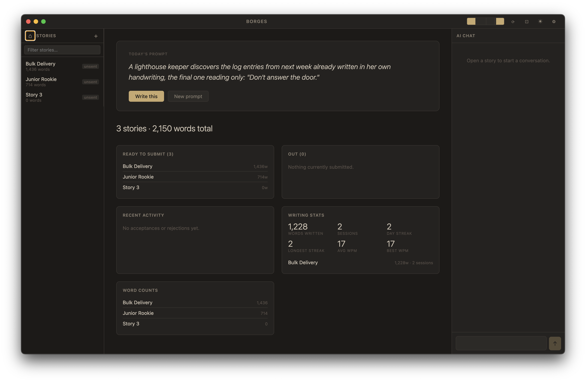
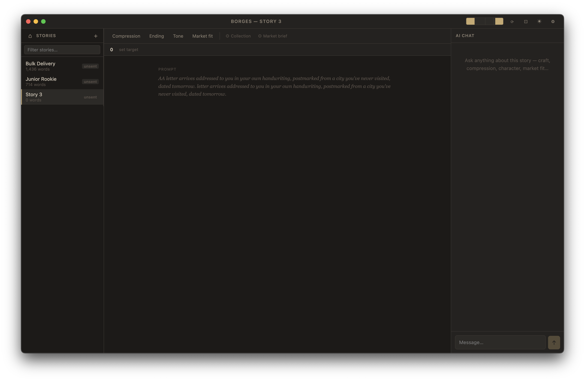

<p align="center">
  
</p>

# Borges

A desktop app for flash fiction writers. Write, analyse, and track submissions — all in one place.

Built with Electron, React, TypeScript, and CodeMirror. AI features run on Claude (default) or any OpenAI-compatible provider.

---

## Features

### Editor
- Markdown editor powered by CodeMirror 6
- Live word count with a configurable target bar
- Auto-save every 10 seconds; manual save with `Cmd+S`
- Revision history (up to 50 snapshots per story)
- Focus mode hides all panels for distraction-free writing
- Dark and light themes; adjustable font size

### AI Analysis
Four one-click analysis modes, each tuned for flash fiction craft:

| Mode | What it does |
|---|---|
| **Compression** | Flags redundant phrases, passive constructions, and over-explained beats with inline suggestions |
| **Ending** | Prose critique of the final paragraph — weight, earn, and closure |
| **Tone** | Maps the dominant register and flags every sentence that drifts from it |
| **Market fit** | Evaluates how well the story suits the selected submission market |

Results appear as annotated passages in the editor. Each annotation can be applied or dismissed individually. A free-form **Chat** panel lets you ask follow-up questions about the story.

Analysis can optionally include:
- **Collection context** — a freeform brief you write about the collection as a whole
- **Market brief** — word-count range, genres, and notes pulled from the selected market

### Dashboard
- Prompts hero — generates a single evocative one-sentence writing prompt on demand
- Writing stats — session history, words written per day, WPM

### Submission tracker
- **Markets** — store name, URL, word-count limits, simultaneous-submission policy, genres, and notes; mark active/inactive
- **Stories** — log each submission, track status (`pending`, `pending-revision`, `accepted`, `rejected`, `withdrawn`), and view history per story

---

## Screenshots





---

## Getting started

### Requirements
- Node.js 20+
- An Anthropic API key (or an OpenAI-compatible endpoint)

### Install and run
```bash
npm install
npm run dev
```

### Configure
Open **Borges → Preferences** (or `Cmd+,`) on first launch and set:

- **API key** — your Anthropic key, or the key for your custom provider
- **Collection folder** — where your `.md` story files live (defaults to `~/Documents/borges-collection`)

Settings are stored in `~/.borges/config.json`.

### Build a distributable
```bash
npm run package          # macOS universal DMG
npm run package:win      # Windows NSIS installer
npm run package:linux    # Linux AppImage
```

---

## Custom AI provider

Borges defaults to Claude (`claude-sonnet-4-6` for analysis, `claude-haiku-4-5` for prompts). To use a different provider add an `ai` block to `~/.borges/config.json`:

```json
{
  "ai": {
    "baseURL": "https://your-openai-compatible-endpoint/v1",
    "model": "your-model-name",
    "promptModel": "your-fast-model-name"
  }
}
```

When `baseURL` is set, Borges switches to the OpenAI-compatible client. The same `apiKey` field is used.

---

## Project structure

```
src/
  main/
    index.ts          — Electron main process, window setup
    ipcHandlers.ts    — IPC bridge between renderer and filesystem/AI
    aiService.ts      — Streaming AI calls (Anthropic + OpenAI-compatible)
    fileSystem.ts     — Story CRUD, markets, submissions, revisions, telemetry
    globalConfig.ts   — ~/.borges/config.json read/write
  preload/
    index.ts          — Exposes window.api to renderer via contextBridge
  renderer/
    components/       — React UI (Editor, Sidebar, Dashboard, AIChat, etc.)
    store/
      borgesStore.ts  — Zustand global state
    types/
      borges.ts       — Shared TypeScript types
```

### Data layout (per collection)

Each collection folder contains your `.md` story files plus a `.borges/` directory:

```
~/Documents/borges-collection/
  my-story.md
  another-story.md
  .borges/
    config.json       — per-story metadata + collection context
    order.json        — sidebar sort order
    session.json      — last open story + chat history
    markets.json
    submissions.json
    telemetry.json
    revisions/
      my-story/
        <timestamp>_<id>.json
```

---

## Scripts

| Command | Description |
|---|---|
| `npm run dev` | Start in development mode with hot-reload |
| `npm run build` | Compile renderer, main, and preload |
| `npm run typecheck` | Type-check all TypeScript |
| `npm run package` | Build + package macOS DMG |
| `npm run package:win` | Build + package Windows installer |
| `npm run package:linux` | Build + package Linux AppImage |

---

## Tech stack

- **Electron 33** + **electron-vite** — desktop shell and build tooling
- **React 18** + **Zustand** — UI and state management
- **CodeMirror 6** — markdown editor
- **@anthropic-ai/sdk** + **openai** — AI streaming
- **TypeScript 5**, **Vite 5**
